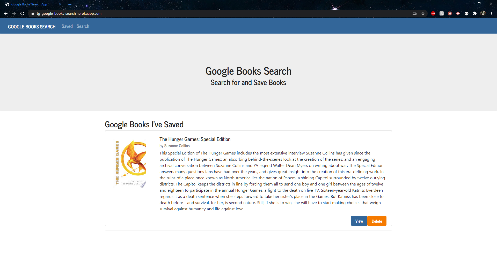
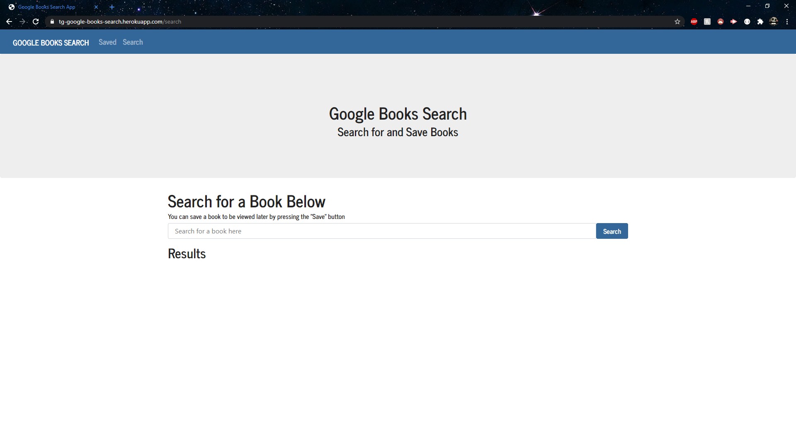
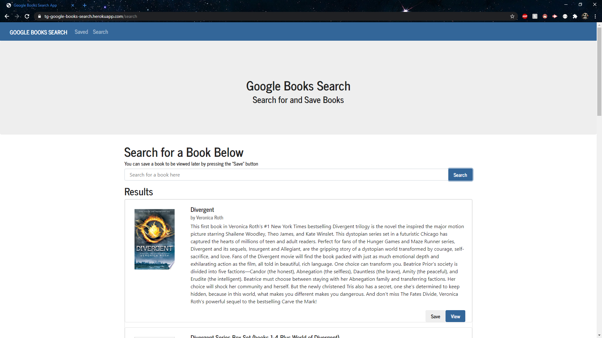
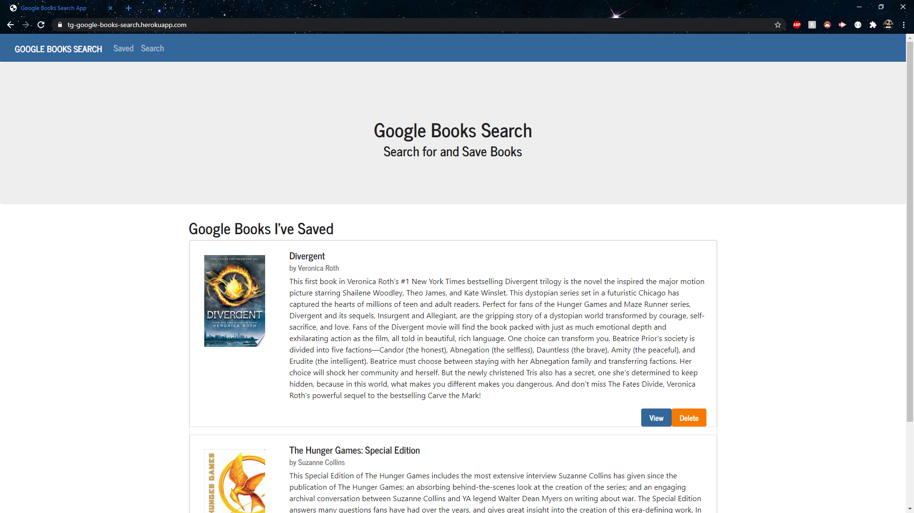
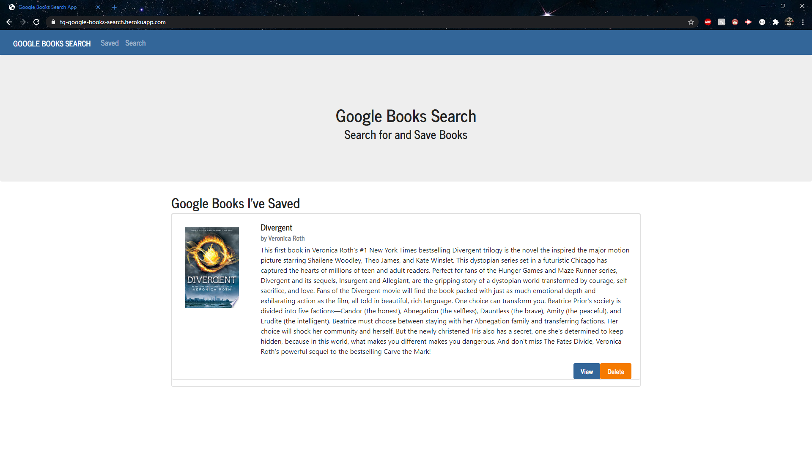

# TG-Google-Books-Search
## by Travis Gray

This app is designed to demonstrate my ability to utilize everything we've learned in this class. This app uses the following packages and languages:

* HTML
* CSS
* Javascript
* React
* MongoDB
* Express
* Node.Js

The app utilizes a Google Books API to search for and save books to a database. There is also a view button that will take you to the book's website on Google.

## Instructions

When you bring up the app, you'll be greeted with the saved page. If there are any items that you've saved when performing a search and are currently in the database, they will be displayed here. The _Navbar_ at the top has two links to go to either the search page or the saved page.

By clicking on the Search link in the Navbar, you will be taken to the _Search_ page where you can perform a search for any book. When performing a search, I have set it up so that it only searches for the keyword in the _Title_.

In the search bar, I typed in the keyword "_Divergent_" and clicked on the search button to the left. It brought up the results, displayed in a card formation with 1 card per row. The card displays the name of the book, the author, a description of the book, an image of the cover, and two buttons with the option to _View_ or _Save_ the result. The view button will bring you to the books page on the Google website. The save button will save the book to the database in the background to be viewed when you go back to the _Saved_ section of the website.

After going back to the _Saved_ section of the website, you can see that the new book has been added to the list that displays all of the previously viewable information. You are given the same option to view but you have a new button that will _Delete_ the book from the database.

I have deleted the previously saved "_Hunger Games_" book and displayed the final result here with the remaining Divergent book.